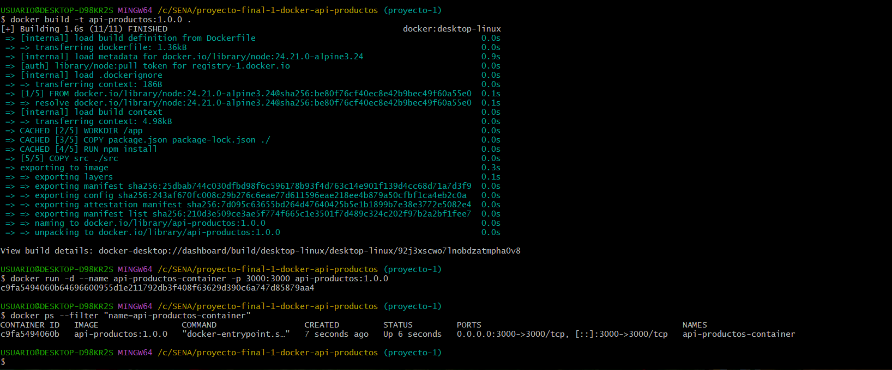
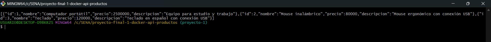
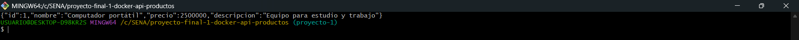
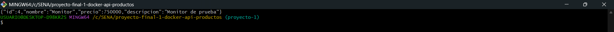
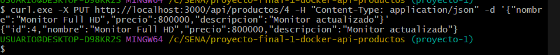
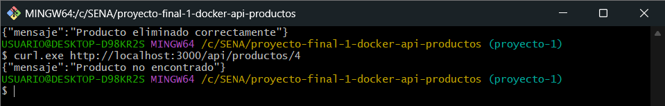
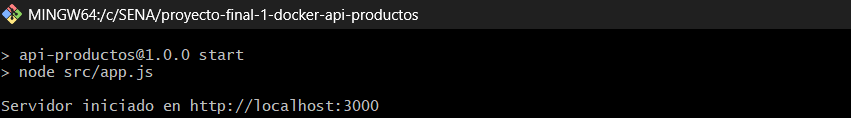
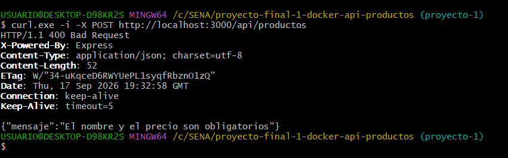
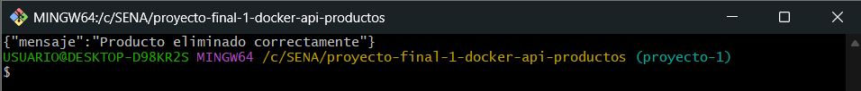

# Proyecto 1 — API REST de Productos con Docker

## 1. Descripción

Este proyecto corresponde a una API REST de productos desarrollada con Node.js, Express y JavaScript. La aplicación permite listar, consultar, crear, actualizar y eliminar productos mediante solicitudes HTTP.

Los productos se almacenan temporalmente en un arreglo de JavaScript en memoria. Por esta razón, los datos creados o modificados durante la ejecución se reinician cuando se detiene o reinicia la aplicación.

El objetivo principal del proyecto es empaquetar la API dentro de una imagen Docker. De esta manera, la aplicación puede ejecutarse en un contenedor sin instalar Node.js directamente en el equipo donde se despliegue.

## 2. Objetivos

- Comprender la diferencia entre una imagen Docker y un contenedor.
- Crear un Dockerfile para una aplicación Node.js.
- Construir una imagen Docker propia.
- Ejecutar un contenedor a partir de la imagen creada.
- Publicar la API mediante el mapeo de puertos.
- Utilizar `.dockerignore` para excluir archivos innecesarios.
- Administrar las operaciones básicas del ciclo de vida de un contenedor.
- Probar los endpoints de una API REST y sus respuestas HTTP.

## 3. Tecnologías utilizadas

- Node.js
- Express
- JavaScript
- Docker
- Git
- GitHub
- curl

## 4. Estructura del proyecto

```text
proyecto-final-1-docker-api-productos/
├── src/
│   ├── app.js
│   └── data/
│       └── productos.js
├── evidencias/
├── .dockerignore
├── .gitignore
├── Dockerfile
├── package.json
├── package-lock.json
└── README.md
```

- `src/app.js`: configura Express, define el puerto y contiene los endpoints de la API.
- `src/data/productos.js`: contiene el arreglo con los productos almacenados en memoria.
- `evidencias/`: almacena las capturas de la construcción, ejecución y pruebas del proyecto.
- `.dockerignore`: excluye archivos innecesarios del contexto de construcción de Docker.
- `.gitignore`: evita que dependencias y archivos locales sean incluidos en Git.
- `Dockerfile`: contiene las instrucciones para construir la imagen de la aplicación.
- `package.json`: describe el proyecto, sus scripts y la dependencia de Express.
- `package-lock.json`: registra las versiones exactas de las dependencias instaladas.
- `README.md`: contiene la documentación y las instrucciones de uso del proyecto.

## 5. Requisitos

Para construir y ejecutar el proyecto se necesita:

- Git.
- Docker Desktop.
- curl o Postman para realizar las pruebas de la API.

Node.js solamente es necesario si se desea ejecutar la aplicación localmente sin Docker.

## 6. Clonar el repositorio

```bash
git clone https://github.com/JuanEstebanLT/proyecto-final-1-docker-api-productos.git
cd proyecto-final-1-docker-api-productos
```

## 7. Ejecución local opcional

Para ejecutar la API sin Docker, primero se instalan las dependencias y luego se inicia la aplicación:

```bash
npm install
npm start
```

La API queda disponible en:

```text
http://localhost:3000
```

Los datos permanecen en memoria mientras la aplicación está activa y vuelven a su estado inicial al reiniciarla.

## 8. Construcción de la imagen Docker

Desde la raíz del proyecto, ejecutar:

```bash
docker build -t api-productos:1.0.0 .
```

En este comando:

- `api-productos` es el nombre asignado a la imagen.
- `1.0.0` es la versión o tag de la imagen.
- El punto `.` indica que el directorio actual es el contexto de construcción.

## 9. Verificar la imagen

Para comprobar que la imagen fue construida correctamente:

```bash
docker images api-productos
```

## 10. Ejecutar el contenedor

```bash
docker run -d --name api-productos-container -p 3000:3000 api-productos:1.0.0
```

Los elementos del comando significan:

- `-d`: ejecuta el contenedor en segundo plano.
- `--name api-productos-container`: asigna un nombre al contenedor.
- `-p 3000:3000`: publica el puerto 3000 del contenedor en el puerto 3000 del equipo.
- `api-productos:1.0.0`: indica la imagen utilizada para crear el contenedor.

## 11. Verificar el contenedor

Para listar los contenedores que se encuentran en ejecución:

```bash
docker ps
```

También se puede filtrar el resultado por el nombre del contenedor:

```bash
docker ps --filter "name=api-productos-container"
```

## 12. Logs

Los mensajes generados por la aplicación dentro del contenedor se consultan con:

```bash
docker logs api-productos-container
```

## 13. Endpoints de la API

| Método | Endpoint | Descripción |
|---|---|---|
| GET | `/api/productos` | Listar productos |
| GET | `/api/productos/:id` | Obtener producto por ID |
| POST | `/api/productos` | Crear producto |
| PUT | `/api/productos/:id` | Actualizar producto |
| DELETE | `/api/productos/:id` | Eliminar producto |

La ruta `GET /` permite comprobar de forma sencilla que el servidor está funcionando.

## 14. Pruebas con curl

Los siguientes comandos pueden ejecutarse desde Git Bash mientras el contenedor está activo.

### Obtener todos los productos

```bash
curl.exe http://localhost:3000/api/productos
```

### Obtener un producto por ID

```bash
curl.exe http://localhost:3000/api/productos/1
```

### Crear un producto

```bash
curl.exe -X POST http://localhost:3000/api/productos -H "Content-Type: application/json" -d '{"nombre":"Monitor","precio":750000,"descripcion":"Monitor de prueba"}'
```

### Actualizar un producto

En este ejemplo se actualiza el producto con ID `4`, creado en el paso anterior:

```bash
curl.exe -X PUT http://localhost:3000/api/productos/4 -H "Content-Type: application/json" -d '{"nombre":"Monitor Full HD","precio":800000,"descripcion":"Monitor actualizado"}'
```

### Eliminar un producto

```bash
curl.exe -X DELETE http://localhost:3000/api/productos/4
```

### Consultar un registro inexistente

Después de eliminar el producto, la siguiente solicitud responde con HTTP 404:

```bash
curl.exe http://localhost:3000/api/productos/4
```

Una solicitud `POST /api/productos` sin `nombre` o sin `precio` responde con HTTP 400 porque estos campos son obligatorios.

## 15. Códigos HTTP utilizados

- `200 OK`: la solicitud se procesó correctamente. Se utiliza al consultar, actualizar o eliminar productos.
- `201 Created`: el producto fue creado correctamente.
- `400 Bad Request`: faltan datos obligatorios, como el nombre o el precio.
- `404 Not Found`: no existe un producto con el ID solicitado.

## 16. Archivo .dockerignore

El archivo `.dockerignore` excluye los siguientes elementos:

- `node_modules`: dependencias instaladas en el equipo local.
- `.git`: historial y metadatos del repositorio.
- `.gitignore`: configuración local de archivos ignorados por Git.
- `npm-debug.log*`: posibles registros de errores generados por npm.

Estas exclusiones evitan enviar archivos innecesarios al contexto de construcción y ayudan a mantenerlo más pequeño y organizado.

## 17. Ciclo de vida del contenedor

### Consultar contenedores activos

```bash
docker ps
```

### Consultar los logs

```bash
docker logs api-productos-container
```

### Detener el contenedor

```bash
docker stop api-productos-container
```

### Iniciar nuevamente el contenedor

```bash
docker start api-productos-container
```

### Eliminar el contenedor

```bash
docker rm api-productos-container
```

Para eliminar un contenedor, primero debe estar detenido. El comando `docker rm` elimina el contenedor, pero no elimina necesariamente la imagen utilizada para crearlo.

## 18. Imagen vs. contenedor

Una **imagen** es una plantilla inmutable que contiene la aplicación, sus dependencias y la configuración necesaria para ejecutarla.

Un **contenedor** es una instancia creada a partir de una imagen. Puede iniciarse, detenerse y eliminarse sin modificar la imagen original.

En este proyecto:

- `api-productos:1.0.0` es la imagen.
- `api-productos-container` es el contenedor creado a partir de esa imagen.

## 19. Evidencias

### Construcción de la imagen y verificación del contenedor



### Consulta de todos los productos



### Consulta de un producto por ID



### Creación de un producto



### Actualización de un producto



### Eliminación de un producto



### Consulta de los logs del contenedor



### Validación de un POST incorrecto



### Respuesta obtenida al eliminar un producto



## 20. Autor

Juan Esteban Lezcano Tejada

Tecnología en Análisis y Desarrollo de Software — ADSO

SENA
